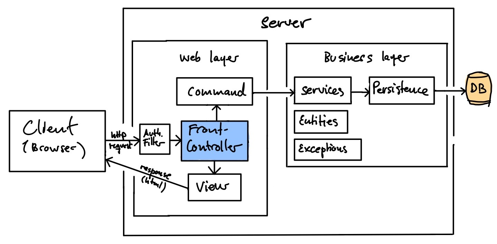

# Template for Java webprojects

This startcode is for 2. semester on Computer Science in Lyngby and Bornholm. It has been
developed by the teachers over the past 3-4 years. Java webprojects can obviously be
organized in numerous ways. The purpose of this project is first and foremost to demonstrate
a number of foundational techniques and principles, that can help a software team to keep 
the codebase organized, when developing larger webprojects. The architecture and some of the
details are also serving pedagogical purposes. By saying this, we would like to emphasize
that there is not such a thing as a universal "best practice" when it comes to developing 
systems. It all depends on the scope of the project, the team, and the context. And since
we are on an educational track, we need to keep in mind, that we are here to learn a lot of
basic skills and techniques. Step by step.

**The startcode is:**
 
- A client/server multipage application developed in Java, JSP, html, css, and bootstrap.
- Built with Maven
- Maintained in a GitHub repository
- Supposed to be deployed on a Tomcat Webcontainer v. 8 or 9.

**The startcode makes use of several design patterns:**

- Model View Controller (MVC pattern)
- Frontcontroller pattern
- Command pattern
- Singleton pattern
- Facade pattern
- Dependency injection

**The startcode contains these features out of the box:**

- A frontpage with a header, body, footer, main menu, and links to login and sign up page
- A basic design template with html, css, and bootstrap
- A login page
- A registration / sign up page
- A logout method
- A customer page that can only be accessed by a logged-in user with a customer role
- An Employee page that can only be accessed by a logged-in user with an employee role
- A layered architecture with a frontend, facades, persistence, entities, services and more
- A database and datamapper to handle user logins
- A skeleton for exception handling and logging
- The ability to handle deep url-linking
- A basic security layer, that protects certain pages based on user login and roles
- An easy way to initialize datastructures for the application at first contact
- The JDBC connection is prepared to be initialized from environment variables to avoid
exposing credentials on GitHub.

## How to install the startcode for development

You need three main steps to get started:

1. Git:
    1. Clone the project (not fork): [https://github.com/jonbertelsen/sem2-startcode](https://github.com/jonbertelsen/sem2-startcode)
    2. Rename the project folder if needed (to cupcake, webshop etc)
    3. Make it your own Git project by first removing the `.git` folder (use `rm -rf .git/`). Then
       create a fresh repo with `git init`, `git branch -m main`,  `git add .`, `git commit -m "First commit"`
    4. Create a repo on Github and push project
2. Database:
    1. Create a schema/database for the project in MySql. Ex: 'cupcake'
    2. Create a test-database for the integration tests in MySql. Ex: 'cupcake_test'
    3. Run the `dbInit.sql` script in the persistence folder to populate database with user a table. Observe
       carefully the instructions in the script file if you need renaming.
3. Java / IntelliJ:
    1. Open project in IntelliJ
    2. Rename the project to your own needs
        1. Right-click the project root in IntelliJ and rename
        2. Change the name sem2-startcode in the pom.xml file where needed
    3.  Rename the database names in two places:
        1. In the top of the FrontController.java file: Change `startcode` in the jdbc string `jdbc:mysql://localhost:3306/startcode?serverTimezone=CET`
        2. In the top of the UserMapperTest.java class, set the name of your database in the constant "DATABASE".
    4. Create a Tomcat configuration by running the project

# Architecture

The project uses a layered architecture. The layering is not strict, but in general, the principle
is that no layer should reference other than one layer below itself. We have also tried to
build the architecture around the MVC design pattern.

   
## The Client
Is typically a web-browser that `requests` resources on a webserver through the `http protocol`. 
A static html page, an image, a css-file, a javascript file or the result from a dynamic jsp page.

Note that

-  Everything that happens on the client-side is usually related to `frontend programming`
-  The request is typically a `GET-request` or a `POST-request`.
-  It is possible to send parameters along with the request. With `GET` is happens over the uri, like
   `http://localhost:8080/user.jsp?id=23`. With `POST` as form parameters.

## The (web)server
Application code running on a web server is usually called the `backend`.
On the 2. semester we use Tomcat as our web server. Technically speaking Tomcat is called a 
servlet container, because its primary purpose is to process java servlets. However, Tomcat
is also able to act as a webserver, serving static content. The web application deployed on
Tomcat can be organized in various ways. The startcode backend architecture is divided into a
web layer and a business layer. 

### The Web Layer
Everything in the web layer is closely related to receiving a request, getting stuff done in the
business layer, and then sending a response to the desired receiver. We are relying heavily on
a `Frontcontroller` to organize the flow of the application. The web layer consists of:

- `Authentication Filter`: Checks that the client making the request has the
  necessary credentials to view the requested resource. This means that a basic security check is done
  up front by checking for all protected pages and commands:
    1. That the user is logged in
    2. That the user has the required role for accessing the page
  If the request passes the security check, it will be passed on to the `FrontController`.
- `FrontController`: The central hub for directing all requests in and out of the web server. 
  The FrontController receives a command and a request object with parameters sent from the client. 
  The command is extracted from the `URI` and looked up in a hashmap in the `Command` class. After the
  command is executed, the FrontController redirects the request to a target jsp page.
- `Command Class`: This class is implementing a Command Pattern as an abstract class. The commands
are stored in a hashmap<k,v> with the command name as the value and an instantiated subclass of 
  the Command class depending on the use case. The two subclasses are:
    1. `CommandProtectedPage`: This subclass is used for protected pages. It takes two parameters
       in the constructor: `pageToShow` and `role`. The first is the name of the destination page 
       that the FrontController should redirect the flow to after the execution of the command, and the
       `role` parameter is the name of the user role, that is needed for executing the command. In this
       version of the startcode, it is only possible to have one role for each page. This could be 
       extended to include more roles.
    2. `CommandUnProtectedPage`: This subclass is used if the command should be executed for any request
       without needing to be logged in. The constructor only takes one parameter, `pageToShow`.
A third subclass named `UnknownCommand` also exists. This will be returned if the given command 
       doesn't exist in the hashmap. This will result in a `404 Page not found` response.
- `View layer`: A collection of files in the webapp folder that pulls together the final rendering
  of the response. In this version of the startcode, most jsp-files are held in the `WEB_INF` folder.
  Files in the `WEB-INF` folder cannot be accessed unless the request is passed through a servlet. It 
  means that the pages have a basic protection, and another advantage is that we can initialize 
  the webapplication in the FrontController. Note the folder named `tags` in the `WEB-INF` folder. It
  contains a template file called `genericpage.tag`. It's a basic template for jsp pages. This means
  that we can re-use a lot of html, css, and Bootstrap and focus on what is in <body> part. As a rule
  of thumb, we avoid using Java Scriptlets `<% %>` in the `View layer` and prefer JSTL and Expression Language.
  Likewise, we avoid generating HTML outside the `View layer`. 
       
The flow of a request can be visualization like below. Sometimes we don't need to pull on the
business layer, but the example is showing a request needing a lookup in the database:

### The Business layer
Everything in the `business layer` is closely related to the business domain, and core 
functionality of the application. 

- `entities`: Contains base classes that typically corresponds to a table in the database. 
  Entity classes often have an id attribute. Examples could be Customer, Order, Product etc.
- `services layer`: Contains classes that supports the application with calculations, 
facade methods and various helper methods.
- `exceptions`: Contains classes that typically are used when throwing exceptions.
- `persistence layer`: Contains classes that are used to fetch and save data from external sources. 
Most often a database. In this startcode we name those classes `datamappers`. We have also included
a special class called `Database.java` in the `persistence layer` that is used for connecting to
the database through `JDBC`. Note that the login credentials and URI for the database is injected
into the constructor of the `Database.java`. This is called `dependency injection`. The reason is
that we wish to be able to change the connection string and user credentials when testing the 
class. And using `dependency injection` is a way to provide that possibility.

## How to deploy the website to a Droplet on Digital Ocean

Please follow this [deployment-guide](documentation/deployment.md) to migrate your local development version to a Droplet at Digital Ocean.

