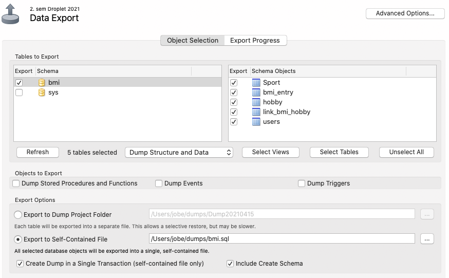

# Deploying your website on a Droplet

The webproject is developed locally. Running on a local 
Tomcat container and MySql server. On this semester, we
deploy our websites manually. This is how it's done:

## The hosting environment

We expect that you have the following setup running at Digital Ocean:

1. You have set up a Ubuntu server by following [this tutorial](https://cphbusiness.mrooms.net/mod/book/view.php?id=325358&chapterid=4695).
2. You have installed MySql Server 8 on the Droplet following [this tutorial](https://cphbusiness.mrooms.net/mod/book/view.php?id=325358&chapterid=4694).
3. You have installed Tomcat 9 on the Drolet following [this tuturial](https://cphbusiness.mrooms.net/mod/book/view.php?id=325358&chapterid=4696).
4. You have ssh access to your Droplet

## A) Migrate your database to the Droplet:

1. Export the bmi-database from Workbench to the file `bmi.sql`: Server | Data export. Make sure that you copy
   both structure and data (tick the `include create schema` checkbox). Like this:
   


2. Open the file in Workbench and check that all table names are in lower case.
3. Log into your Droplet: `> ssh brugernavn@ipnumber`
4. Copy bmi.sql to the Droplet:
    1. From localhost machine: Open a terminal in the folder with bmi.sql and run this command:
    2. `> scp bmi.sql brugernavn@ipnummer:/home/brugernavn`
5.  Log into mysql on your Droplet through the terminal: `mysql -u root -p`
6.  Import your bmi database: `> source /home/jobe/bmi.sql;`
7.  Check the database is imported correctly:
    - `> show databases;`
    - `> use bmi;`
    - `> select * from sport;`
    
## B) Set up a database user for the webapplication:

8.  Create a database user (call it "bmi"):
    - `> CREATE USER 'bmi'@'localhost' IDENTIFIED BY 'sikkertpassword';`
9. Create a few, but necessary privileges:
    - `> GRANT SELECT, INSERT, UPDATE, DELETE ON bmi.* to 'bmi'@'localhost';`
10. Check everything is okay:
    - `> show grants for 'bmi'@'localhost';`
    - `> select user, host from mysql.user;`

## C) Set up environment variables for database user credentials:

11. Exit fra MySql og gå i "super user mode": `> sudo su`
    
12. Opret filen `setenv.sh` i `/opt/tomcat/bin` med nano og lav 3 miljøvariabler:

```text
### Env variabler
export DEPLOYED="PROD"
export JDBC_USER="bmi"
export JDBC_PASSWORD="sikkertpassword"
export JDBC_CONNECTION_STRING="jdbc:mysql://localhost:3306/bmi?serverTimezone=CET"
```
13. Restart Tomcat: `> service tomcat restart`

## D) Build and upload a war-file:

14. Build a war-file in IntelliJ: `Build | Build Artifacts | bmi:war | rebuild`
    The war-file can be found in the root of the target-folder
    
15. Log into your Tomcat manager on the Droplet: http://ipnumber:8080
    - Hit the "Manager App"-button on the frontpage and log in
    - Find the section "WAR file to deploy" and do it!.
    
## Run the application:

16. When the file is uploaded and deployed: click the link to run the application
    
17. In case of problems: Keep and eye on the catalina.out file in the `opt/tomcat/logs`folder.
    - `> tail -50 /opt/tomcat/logs/catalina.out`